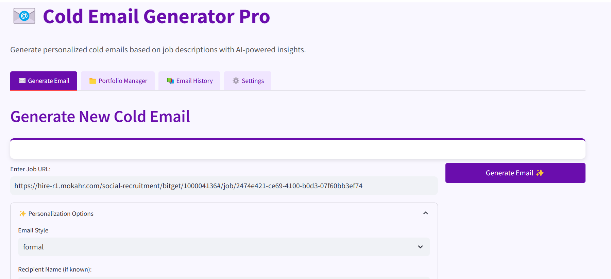

# 📧 Cold Email Generator 

A sophisticated cold email generation tool for service companies, leveraging Groq, LangChain, and Streamlit. This application allows business development professionals to create highly personalized cold emails based on job listings from company career pages, with AI-powered company research and intelligent portfolio matching.

## Overview

**Imagine this scenario:**
- Nike is looking for a Principal Software Engineer and will spend significant resources on hiring, onboarding, and training
- AtliQ, a software development company, can provide a dedicated software engineer to Nike
- Mohan, a business development executive from AtliQ, needs to reach out to Nike with a compelling cold email

This tool helps Mohan create personalized, targeted emails that increase response rates.



## Architecture Diagram


## Key Features

###  AI-Powered Email Generation
- Extract job details from any careers page URL
- Choose from multiple email styles:
  - **Formal**: Professional and structured for traditional organizations
  - **Conversational**: Friendly and personable for startups and modern companies
  - **Problem-Solution**: Identifies pain points and positions AtliQ as the solution

###  Automatic Company Research
- Extracts company values, initiatives, and potential pain points automatically
- Intelligently incorporates relevant company details into emails
- Creates more targeted and personalized outreach

###  Portfolio Management
- Manage and update your portfolio showcases
- Add new portfolio items with technology stacks and links
- Intelligent matching of portfolio examples based on job requirements

###  Follow-up Email Generation
- Generate follow-up emails based on original outreach
- Adds new value and gently requests a response
- Maintains professional tone without being pushy

###  Email History Tracking
- Save generated emails for future reference
- Review past outreach efforts by date, company, and job title
- Generate follow-ups from historical emails

### Customization Options
- Personalization with recipient name
- Call-to-action toggle
- Competitor comparison options
- Adjustable number of portfolio links to include
- Editable email templates

## Setup Instructions

1. **API Key**: Get a Groq API key from [https://console.groq.com/keys](https://console.groq.com/keys). Inside `app/.env` add:
   ```
   GROQ_API_KEY=your_api_key_here
   ```

2. **Install Dependencies**:
   ```bash
   pip install -r requirements.txt
   ```

3. **Run the Application**:
   ```bash
   streamlit run app/main.py
   ```

## Usage Guide

### 1. Generate Cold Email
- Enter the job URL in the input field
- Expand "Personalization Options" to customize:
  - Select email style (formal, conversational, problem-solution)
  - Add recipient name if known
  - Toggle company research, call-to-action, and competitor mention
  - Adjust number of portfolio links
- Click "Generate Email" button
- Review job details and generated email
- Save to history or generate follow-up as needed
- Copy to clipboard for use

### 2. Manage Portfolio
- View current portfolio items
- Add new items with technology stack and link
- Portfolio is automatically saved for future use

### 3. Track Email History
- Review past emails organized by date and job title
- Generate follow-ups from historical emails
- Keep track of your outreach efforts

### 4. Configure Settings
- Update your Groq API key
- Edit email templates for different styles
- View information about the application

## Technical Details

The application uses:
- **Groq LLM**: AI-powered text generation model for creating emails
- **LangChain**: Framework for building LLM applications
- **Streamlit**: Web interface framework for the UI
- **Beautiful Soup**: For parsing web content
- **Pandas**: For data handling and portfolio management

The workflow integrates web scraping, natural language processing, and a carefully designed user interface to create a seamless experience for business development professionals.

